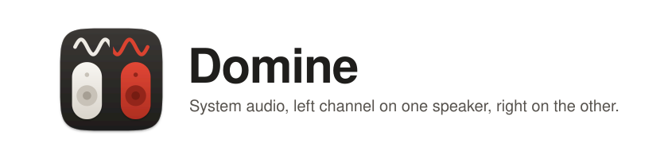
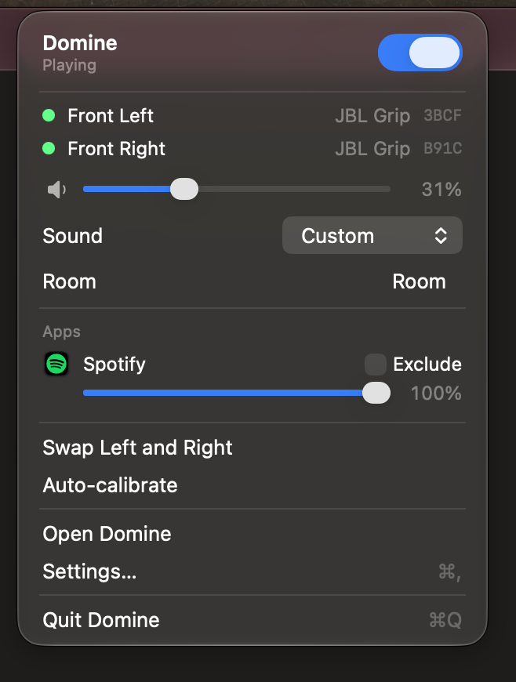
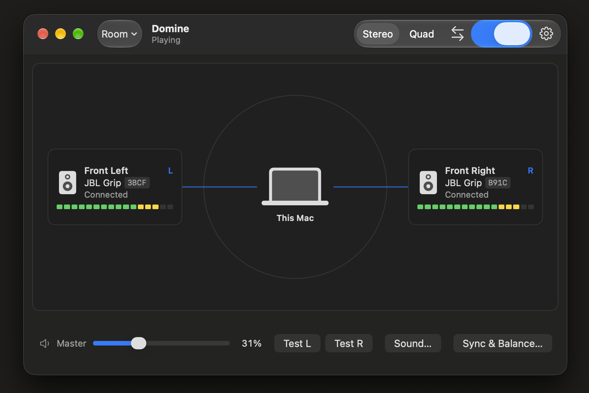

<h1 align="center">
  <picture>
    <source media="(prefers-color-scheme: dark)" srcset="docs/assets/header-dark.svg">
    
  </picture>
</h1>

<p align="center">
  
  
</p>

A macOS app that plays the left channel of system audio on one Bluetooth speaker and the right channel on another. It was built for two JBL Grip speakers but works with any two outputs.


| Menu bar panel | Main window |
|---|---|
|  |  |
| Keeps playback available in the background with quick access to volume, room, app exclusions, and speaker controls. | Shows each speaker's side, connection state, UID suffix, and live level meter around the Mac. |


macOS can combine devices into a Multi-Output Device, but then every speaker plays both channels. 
Domine captures system audio with a Core Audio process tap, sends it to a private aggregate device, and writes left to one speaker and right to the other. 
The aggregate corrects clock drift between the two speakers, and a delay slider (1 ms steps) lines up their Bluetooth latency.

## Status: v0.2.1

Tested daily on a MacBook Pro with two JBL Grips.

**New in 0.2.1**
- Battery level on each speaker card, in red at 15% or less.
- Speakers that drop are reconnected automatically, and a disconnected card has a Reconnect button.
- Keep speakers from turning off: an inaudible 15 Hz tone during silence stops the Grips' auto power-off. On by default.
- Clearer hints when one Grip is missing because the two are paired in the JBL Portable app, or when a phone takes over a speaker.
- Crossfeed slider, and Same sound on both speakers for speakers in different rooms.
- Night mode in the Sound sheet: stronger compression for quieter peaks.
- Nudge the delay by 1 or 5 ms with buttons or the arrow keys while the click test plays.
- Now Playing in the menu bar menu, when macOS provides it.
- Export and import saved rooms.
- Copy Report and per-speaker dropout counts in the debug panel.
- The stage keeps speakers lined up with the drawing when the window is resized.
- Surround with one speaker in front and one behind sends the room sound to the back again.
- "Start routing when speakers connect" waits for every speaker of the current mode, so it works in Surround too.
- Uninstall Domine… in the app menu removes the app, the audio driver, settings and permissions.
- About shows the version without a build number.

**New in 0.2.0**
- Surround mode replaces Quad. Use 2 to 16 speakers, drag each one to where it stands on a top-down stage, or pick a preset (Front and Back, Quad, 5 speaker, 7 speaker, Ring). Quad setups carry over.
- Two speakers work in Surround too: put one in front and one behind, and the Surround slider sends the room sound to the back one.
- Width, Surround, Orbit and Rotation sliders, drawn on the stage so you can see what each one does. The orbit drawing follows the audio.
- Mono in the Sound sheet for Surround, off by default.
- Test Speakers chimes each speaker in turn. Test L and Test R stay in Stereo.
- Play Demo: a short showcase that moves sound around every speaker.
- Auto-calibrate in Surround measures the speakers in pairs around the room.
- Saved rooms: store a speaker setup and switch back to it from the window or the menu bar.
- Per-app volume and exclude from the menu bar's list of playing apps.
- Starting an excluded app no longer cuts the sound for a moment.
- Reopening the window never starts a second engine.
- Licensed under the GNU AGPL 3.0.

**Works**
- Left to one speaker, right to the other, each speaker getting its side on both channels.
- Starts on launch when both speakers are present and switches the Mac's output for you; turning off or quitting puts it back.
- The "Domine" virtual output: volume keys and the macOS volume overlay control both speakers, kept at the same hardware volume.
- Auto-calibrate: the built-in microphone hears both speakers and sets the delay between them. Manual delay and balance in Sync & Balance.
- One speaker drops out: the other plays both sides until it returns. Sleep and wake are handled.
- Sound sheet: presets, 5-band EQ, bass enhancer, compressor, per speaker or linked.
- Menu bar panel, background playback with the window closed, app exclusions for calls.
- Update check against GitHub Releases.

This build is signed for development, not notarized. Other Macs need right-click, Open the first time.

## Install

Download `Domine-0.2.1.pkg` from [Releases](https://github.com/Ethan-Ka/Domine/releases) and run it. It installs the app in Applications and the audio driver, then restarts macOS audio for a few seconds. To update, run the newer installer. To remove everything (app, driver, settings and permissions), choose "Uninstall Domine…" in the app menu or run `scripts/uninstall.sh`.

## Requirements

- macOS 14.4 or later (process taps)
- Xcode 16 or later
- [XcodeGen](https://github.com/yonaskolb/XcodeGen): `brew install xcodegen`

## Development

`project.yml` is the source of truth. The `.xcodeproj` is generated and not checked in, so every script regenerates it first. Build output goes to `build/`.

| Script | What it does |
|---|---|
| `./scripts/run.sh` | Build, quit any running copy, launch the Debug app |
| `./scripts/run.sh --logs` | Same, then stream the app's log in the terminal |
| `./scripts/test.sh` | Run every unit test |
| `./scripts/test.sh DomineDSPTests` | Run one test target (or `Target/Suite`, `Target/Suite/test()`) |
| `./scripts/build.sh` | Build only |
| `./scripts/stop.sh` | Quit Domine; force-quits after 5 seconds |
| `./scripts/logs.sh` | Stream log messages from the `com.ethankawley.Domine` subsystem |
| `./scripts/xcode.sh` | Open the project in Xcode for breakpoints |
| `./scripts/reset-permissions.sh` | Forget the audio capture and microphone grants so macOS asks again |
| `./scripts/clean.sh` | Delete `build/` and the generated project (`--xcode` also deletes old copies in Xcode's DerivedData) |
| `./scripts/install-driver.sh` | Build and install the virtual output driver, then restart coreaudiod (needs sudo) |
| `./scripts/uninstall-driver.sh` | Remove the virtual output driver and restart coreaudiod (needs sudo) |
| `./scripts/release.sh` | Archive, Developer ID sign the app and driver, notarize, and staple into `build/release/` (see [Releasing](#releasing)) |
| `./scripts/package.sh` | Installer: build, sign, notarize, and staple `build/release/Domine-<version>.pkg` from the release output (needs `INSTALLER_IDENTITY`) |
| `./scripts/uninstall.sh` | Installer: remove the app, driver, settings and permissions, forget the pkg receipts, and restart coreaudiod; also in the app menu as "Uninstall Domine…" |

A typical loop: edit, `./scripts/test.sh`, then `./scripts/run.sh --logs` to try it.

While Domine is running, it mutes system audio everywhere except the two speakers. If the app hangs, `./scripts/stop.sh` brings the sound back: Core Audio removes a quit process's tap and private aggregate device.

The first time the engine starts, macOS asks for permission to capture system audio. Debug builds are signed with an Apple Development identity, so the grant survives rebuilds. If the speakers still go quiet after a rebuild, the grant is stale: run `./scripts/reset-permissions.sh` and allow access again.

The same commands without the scripts:

```sh
xcodegen generate
xcodebuild -scheme Domine -configuration Debug -destination 'platform=macOS' build
xcodebuild -scheme Domine -destination 'platform=macOS' test
```

## Virtual output

Optional. `Domine.driver` adds an output device named "Domine" that discards its audio. While Domine routes, it makes this device the system output, so the volume keys and the macOS volume overlay work as usual and Domine applies that volume to both speakers. Without it, Domine falls back to its own volume key handling (Settings > General).

```sh
./scripts/install-driver.sh      # add --dry-run to print the commands
./scripts/uninstall-driver.sh
```

Both ask for an admin password and restart coreaudiod, so all audio stops for a few seconds. After installing, Audio MIDI Setup lists "Domine". If it does not appear, check the driver host's log for a signature error:

```sh
log show --last 5m --predicate 'process CONTAINS "Core Audio Driver"'
```

## Releasing

One-time setup:

1. Install a Developer ID Application certificate in your login keychain (Xcode > Settings > Accounts > Manage Certificates).
2. Store notary credentials under a profile name, using an app-specific password from appleid.apple.com:

   ```sh
   xcrun notarytool store-credentials NAME --apple-id you@example.com --team-id TEAMID
   ```

Each release:

```sh
DEVELOPMENT_TEAM=TEAMID NOTARY_PROFILE=NAME ./scripts/release.sh
```

The stapled app and the signed driver are in `build/release/dist/`, and the zip to distribute (both together) is `build/release/Domine.zip`. Add `--dry-run` to print the commands without running them.

To also build the installer package, install a Developer ID Installer certificate and add `--pkg`, or run `package.sh` after `release.sh`:

```sh
INSTALLER_IDENTITY="Developer ID Installer: Your Name (TEAMID)" DEVELOPMENT_TEAM=TEAMID NOTARY_PROFILE=NAME ./scripts/release.sh --pkg
```

`build/release/Domine-<version>.pkg` installs the app and the driver and restarts coreaudiod. End users remove the app, driver, settings and permissions with "Uninstall Domine…" in the app menu or `./scripts/uninstall.sh`.
### Updates

Releases are published as a notarized `.pkg` on GitHub Releases, tagged `vVERSION`. Updating means downloading and running the installer, which replaces the app and the driver. Domine checks the latest release at launch (at most once a day) and from "Check for Updates…" in the app menu; when a newer version exists it offers to open the installer download. Settings > General has "Check for updates automatically". To publish: run `release.sh --pkg`, create the GitHub release with the tag, and attach the `.pkg`. Bump `CFBundleShortVersionString` in `project.yml` for every release.

## Using two JBL Grips

1. In the JBL Portable app, turn off stereo pairing and party mode on both speakers. A stereo-paired pair shows up on the Mac as a single device.
2. Set the same EQ preset on both.
3. Connect both to the Mac in System Settings > Bluetooth. Both are named "JBL Grip"; renaming one there makes them easier to tell apart.
4. Disconnect any phones from the Grips. A phone can take over playback on one speaker.

## M0 spike

`Spike/M0/main.swift` is a throwaway command-line tool for checking that two speakers stay in sync on this Mac before the real audio path exists. It builds an aggregate of the two devices, points system stereo at channels 1 and 3, and makes the aggregate the default output.

```sh
swiftc -O Spike/M0/main.swift -o /tmp/domine-spike
/tmp/domine-spike list
/tmp/domine-spike run            # picks the two "JBL Grip" outputs
/tmp/domine-spike run UID_A UID_B
```

Ctrl-C restores the previous output and removes the aggregate. On a Grip each side plays about 6 dB quieter than normal during the spike, because the speaker averages in a silent second channel.

## Docs

- [docs/SPEC.md](docs/SPEC.md): design, audio path, and milestones
- [docs/mockups/](docs/mockups/README.md): screen layouts
- [CLAUDE.md](CLAUDE.md): rules for working in this repo

## License

Copyright (C) 2026 Ethan Kawley

Domine is licensed under the [GNU Affero General Public License v3.0](LICENSE). You can use, study, and change it, but anything you distribute or run as a network service that is built on this code must be released under the same license, with full source code.
